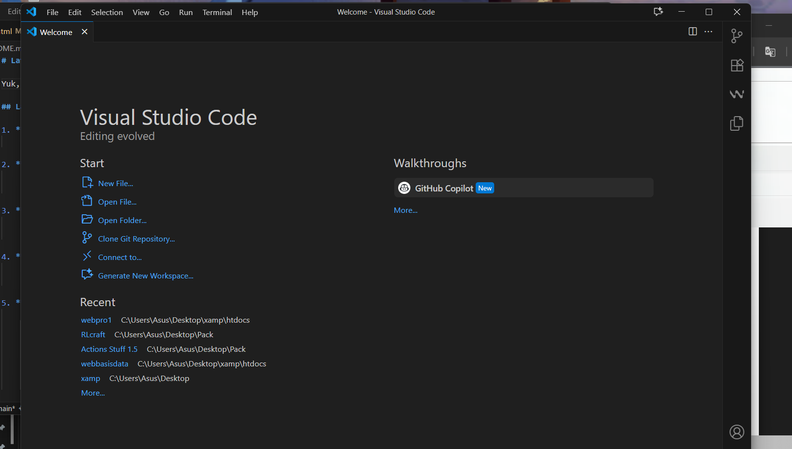
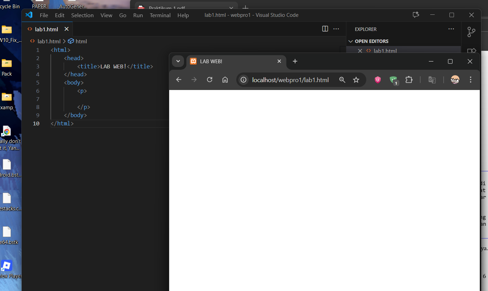
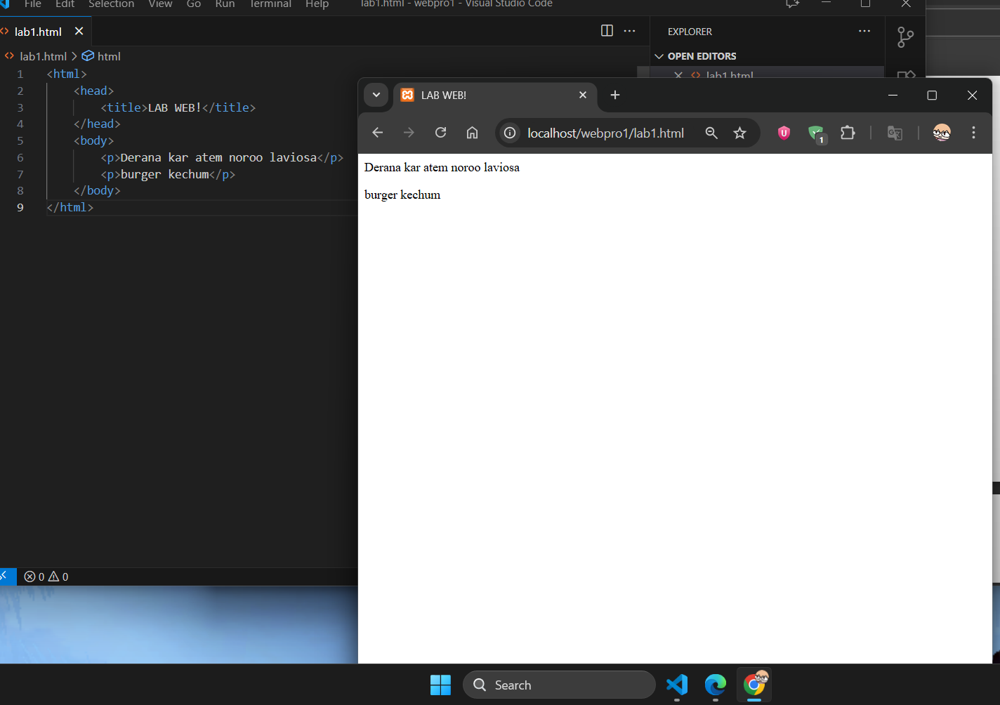
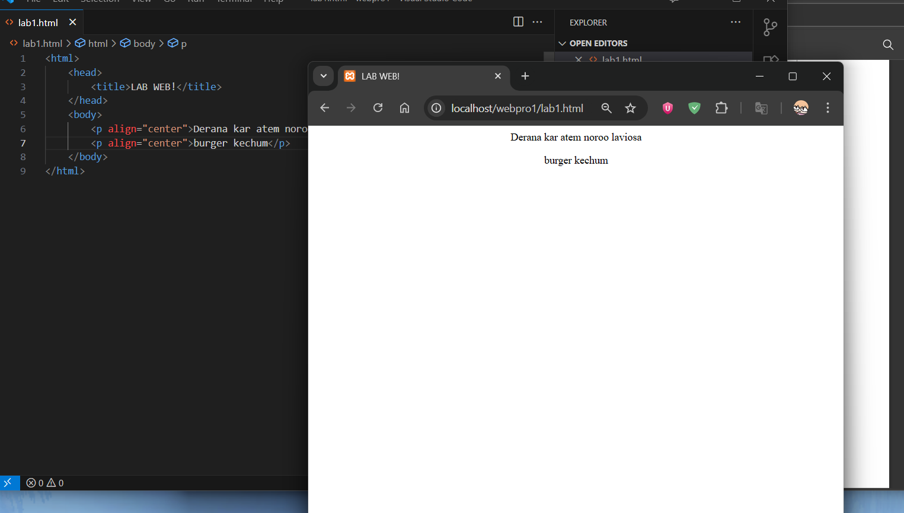
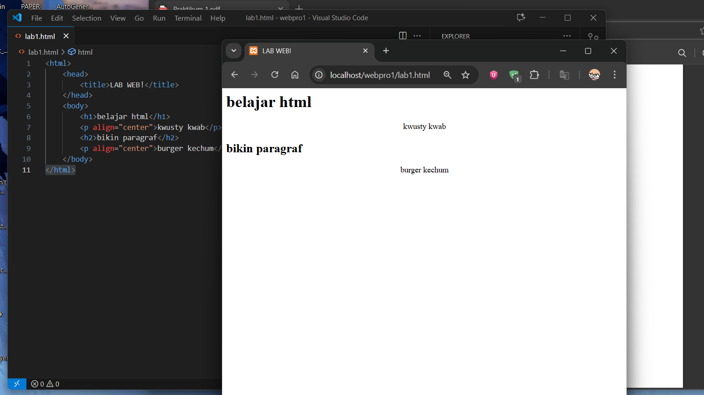
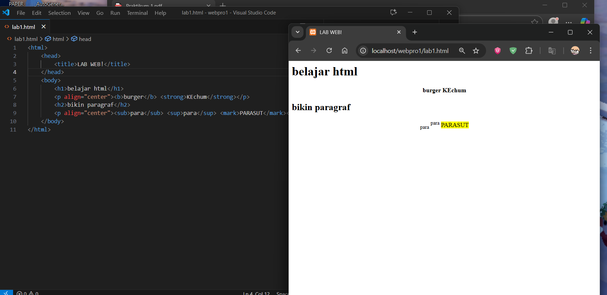
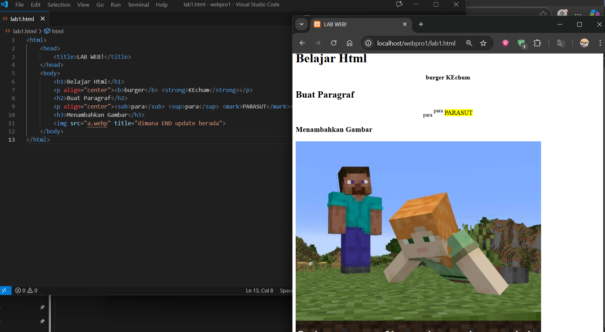
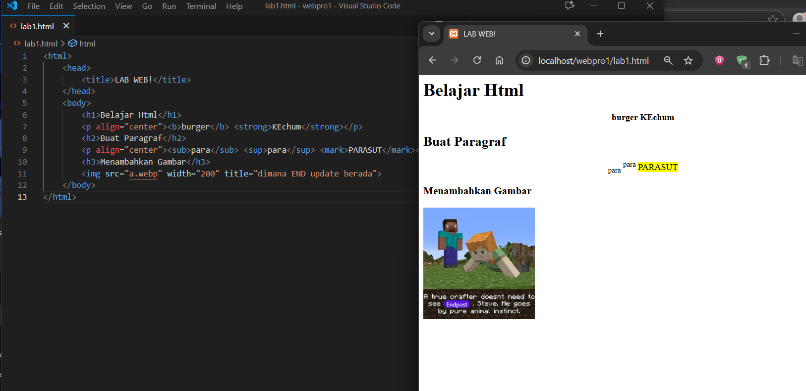
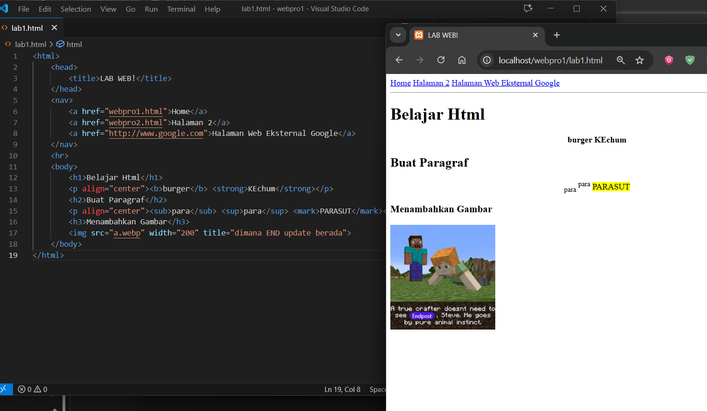
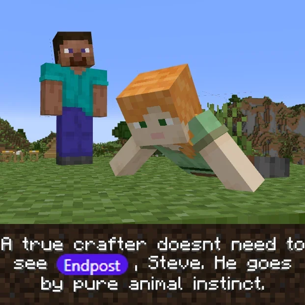

# Latihan HTML dasar

Yuk, bikin file HTML sederhana pakai Visual Studio Code (VS Code).

## Langkah-langkah

1. **Siapkan VS Code**
    - Buka dulu aplikasi Visual Studio Code.
    

2. **Buat File HTML**
    - Buat file baru dan masukkan struktur HTML dasar:
    

3. **Tambah Paragraf**
    - Di bagian `<body>` tambahin paragraf:
    

4. **Kasih Judul di Tiap Paragraf**
    - Tambahin heading sebelum masing-masing paragraf:
    

5. **Format Teks**
    - Pakein format:
    

6. **Masukkan Gambar**
    - Tambahin gambar pakai tag ``:
    

7. **Bikin Navigasi**
    - Tambah navigasi simpel di atas:
    
    *pindahin kedalam body
    
## Contoh Akhir

```html
<!DOCTYPE html>
<html>
<head>  
    <title>LAB WEB!</title> 
</head>

<body>
    <nav> 
        <a href="webpro1.html">Home</a>
        <a href="webpro1.html">Halaman 2</a>
        <a href="http://www.google.com">Halaman Web Eksternal Google</a> 
    </nav> 
    <hr>
    <h1>Belajar Html</h1>
    <p align="center"><b>burger</b> <strong>KEchum</strong></p>
    <h2>Buat Paragraf</h2>
    <p align="right"><sub>para</sub> <sup>para</sup> <mark>PARASUT</mark></p>
    <h3>Menambahkan Gambar</h3> 
     
</body>
</html>
```

---
*Selamat mencoba*